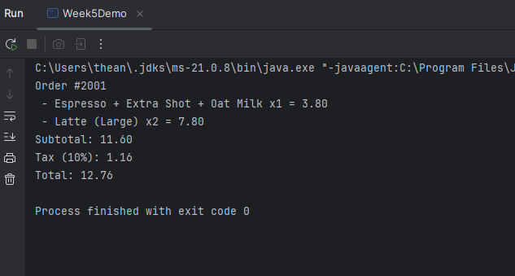
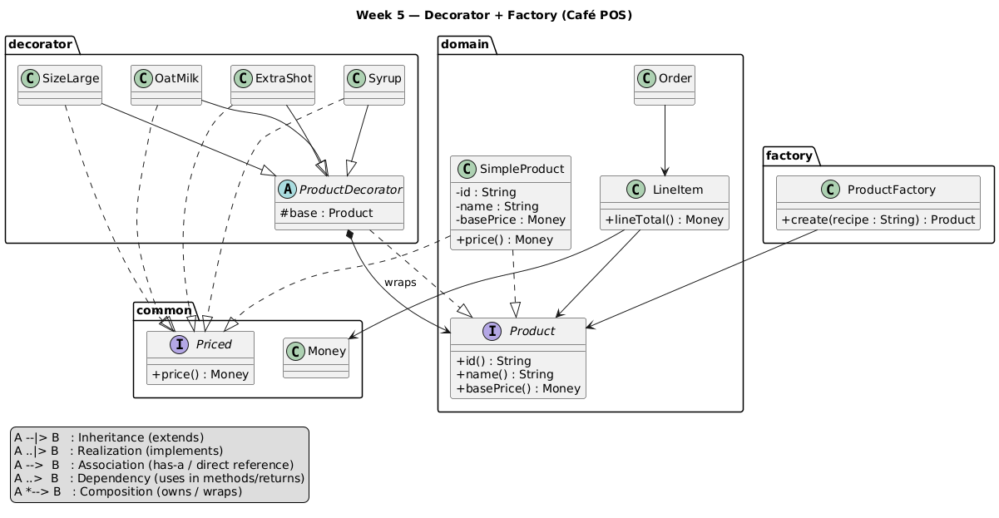

# Week 5 — Decorator + Factory Café POS (Deliverables)

This week extends the Café POS by adding **Decorator** (to stack add-ons onto a base drink) and **Factory** (to build drinks from short recipe strings). Core domain from previous weeks (**Money**, **Product**, **SimpleProduct**, **Order**, **LineItem**, payments, observers) stays intact; we only add composition around products and a central creator.

---

## What Was Added in Week 5

1. **Pricing Interface**
    - `Priced` → defines `Money price();`
    - Implemented by `SimpleProduct` (returns `basePrice()`) and **all** decorators.

2. **Decorator Base + Concrete Add-ons**
    - `ProductDecorator` (abstract) wraps a `Product`; delegates `id()` and `basePrice()`.
    - Concrete decorators (each implements `Priced` and appends to `name()`):
        - `ExtraShot` **(+€0.80)** → `" + Extra Shot"`
        - `OatMilk` **(+€0.50)** → `" + Oat Milk"`
        - `Syrup` **(+€0.40)** → `" + Syrup"`
        - `SizeLarge` **(+€0.70)** → `" (Large)"`
    - Each computes `price()` as: wrapped `price()` (or `basePrice()`) **plus** its surcharge via `Money.add()`.

3. **Order Integration**
   --LineItem.lineTotal()` now uses decorated price when available:
      ```java
      Money unit = (product instanceof Priced p) ? p.price() : product.basePrice();
      return unit.multiply(quantity);
      ```

4. **Product Factory (recipes)**
    - `ProductFactory.create(String recipe)` parses tokens like `ESP+SHOT+OAT+L`.
    - Bases: `ESP` (2.50), `LAT` (3.20), `CAP` (3.00).
    - Add-ons: `SHOT`, `OAT`, `SYP`, `L`.
    - Trims and uppercases tokens; fails fast on unknown tokens.

---

## Week5Demo (what it shows)

- Builds two drinks via `ProductFactory`: `ESP+SHOT+OAT` and `LAT+L`.
- Adds them to an `Order`, prints each line (`name`, `qty`, `lineTotal`), plus subtotal, tax, total.
- Confirms decorators only affect **names** and **unit prices**; Week 2 math remains unchanged.

---

## JUnit Tests (what they prove)

1. **`decorator_single_addon()`**  
   *Builds `Espresso` + `ExtraShot`.*  
   Verifies:
    - `name()` is **"Espresso + Extra Shot"**
    - `price()` is **3.30** (2.50 + 0.80)

2. **`decorator_stacks()`**  
   *Chains `SizeLarge(OatMilk(ExtraShot(Espresso)))`.*  
   Verifies:
    - `name()` is **"Espresso + Extra Shot + Oat Milk (Large)"**
    - `price()` is **4.50** (2.50 + 0.80 + 0.50 + 0.70)

3. **`factory_parses_recipe()`**  
   *Uses `new ProductFactory().create("ESP+SHOT+OAT")`.*  
   Verifies:
    - final `name()` contains **"Espresso"** and **"Oat Milk"**

4. **`order_uses_decorated_price()`**  
   *Adds two × (Espresso + Extra Shot) to an order.*  
   Verifies:
    - `subtotal()` is **6.60** (2 × 3.30)

**Activity — Factory vs. Manual (separate test class)**  
Build `"ESP+SHOT+OAT+L"` via factory **and** by manual wrapping.  
Assertions:
- same `name()`
- same `price()`
- orders have equal `subtotal` and `totalWithTax(10)`

## Demo Output

## UML Diagram


 ---

## Reflection

This week introduced a minimal `Priced` interface so both `SimpleProduct` and all decorators expose a uniform `price()` method.

With that in place, `LineItem` calculates totals using `(product instanceof Priced ? price() : basePrice())`. This keeps the ordering logic closed for modification while still allowing new add-ons to be added freely (OCP).

Each decorator composes behavior by delegating to its wrapped product’s `price()` and then adding a surcharge via `Money.add()`. Stacking remains simple and numerically correct.

The `ProductFactory` centralizes construction from short recipes (e.g., `ESP+SHOT+OAT+L`), so application code never needs to know constructors or chaining order.

To add a new add-on next week, I would implement a new `ProductDecorator` with its label/surcharge and add a single token in the factory—no changes to existing classes.

