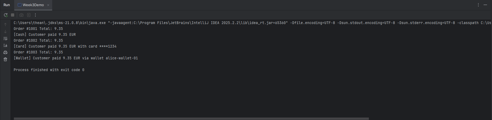
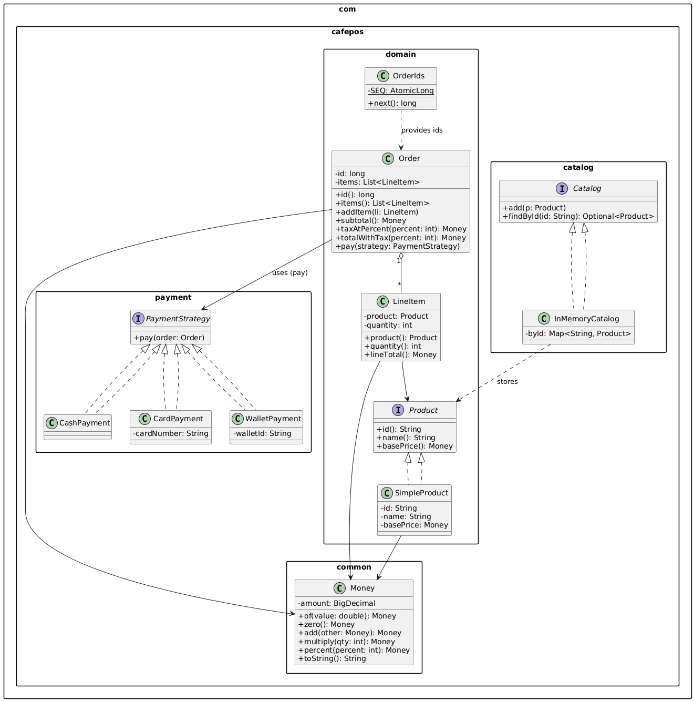

# Week 3 — Strategy Pattern Café POS (Deliverables)

This week extends the Café POS system by adding support for multiple, interchangeable payment methods using the **Strategy pattern**. The core domain from Week 2 (Money, Product, LineItem, Order) stays the same; we only add new payment behaviors and delegate to them.

---

## What Was Added in Week 3

1) **PaymentStrategy (interface)**
- `void pay(Order order);` — contract for all payment methods.

2) **Concrete Strategies**
- `CashPayment` → prints: `[Cash] Customer paid <total> EUR`
- `CardPayment` → masks card to last 4 digits, prints: `[Card] Customer paid <total> EUR with card ****1234`
- `WalletPayment` → prints: `[Wallet] Customer paid <total> EUR via wallet <id>`

3) **Order updated**
- New method `pay(PaymentStrategy strategy)` that checks for non-null and calls `strategy.pay(this);`
- No change to subtotal/tax/total logic.

4) **Week3Demo**
- Builds orders the same way as Week 2, then pays with Cash, Card, and Wallet to show interchangeable behavior.

5) **JUnit test**
- A fake `PaymentStrategy` is injected to verify `Order.pay(...)` delegates correctly.

---

## Demo Output (screenshot)

## UML Output (screenshot)

## Explanation of Behaviours
- Inheritance (is-a): CardPayment is a kind of PaymentStrategy.
- Composition (has-a): Order has many LineItems, which each have a Product and a quantity.
- Interfaces (contracts): PaymentStrategy promises that any payment method will have a pay() method,
- even though each strategy does it differently.