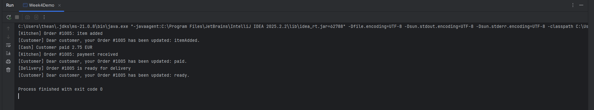
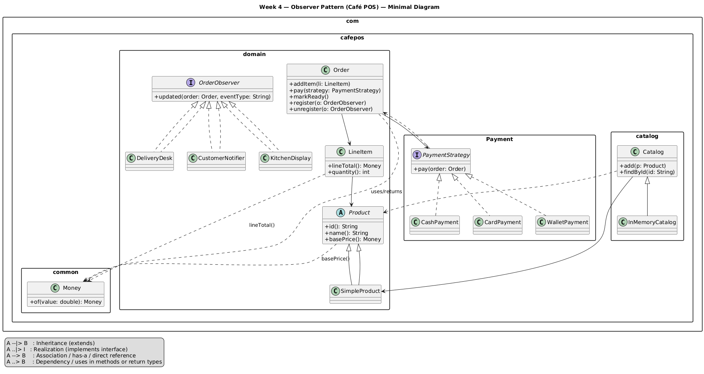

# Week 4 — Observer Pattern Café POS (Deliverables)

This week extends the Café POS system by adding the **Observer pattern**, enabling different parts of the system (like the Kitchen, Delivery Desk, and Customer Notifier) to automatically react to order events. The core domain from previous weeks (Money, Product, LineItem, Order, PaymentStrategy) remains unchanged; we simply added publish/subscribe behavior to `Order`.

---

## What Was Added in Week 4

1. **Observer Interfaces**

* `OrderObserver` → defines `void updated(Order order, String eventType);`
* `OrderPublisher` → defines methods for `register`, `unregister`, and `notifyObservers`.

2. **Order updated**

* Now acts as a publisher:

    * Maintains a list of observers.
    * Calls `notifyObservers("itemAdded")`, `notifyObservers("paid")`, and `notifyObservers("ready")` when relevant actions occur.
    * No hard-coded printing inside `Order` — observers handle reactions.

3. **Concrete Observers**

* `KitchenDisplay` → reacts to `itemAdded` and `paid` events.
* `DeliveryDesk` → reacts to `ready` events.
* `CustomerNotifier` → reacts to all events with polite customer messages.

4. **Week4Demo**

* Registers all three observers to a new `Order`.
* Adds an item, processes payment, and marks the order ready.
* Demonstrates how each observer responds independently.

5. **JUnit Tests**

* `ObserverItemAddedTest` verifies `itemAdded` is broadcast correctly.
* `ObserverMultipleObserversTest` ensures multiple observers both receive the same `ready` event.

---

## Demo Output (screenshot)

## UML Output (screenshot)

---

## Explanation of Behaviours

* **Decoupling:** `Order` doesn’t need to know how Kitchen, Delivery, or Customer components behave; it just announces facts.
* **Open/Closed Principle:** New observers (like `LoyaltyNotifier` or `AuditLogger`) can be added without editing `Order`.
* **Real-world Analogy:** Similar to GUI event listeners or push notifications one source, many independent reactions.
