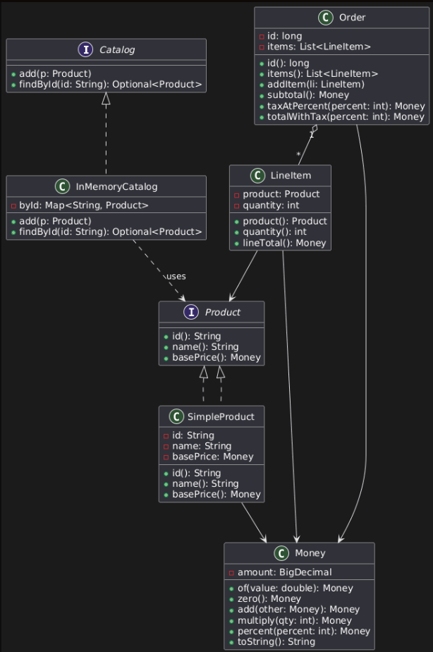

# Week 2 — Café POS Foundations (OOD)

> I missed the first lab due to personal circumstances, so I did not have a partner for this section of the lab.

---

## Why do we use a dedicated `Money` class instead of storing prices as `double`?

- To avoid floating-point rounding errors (e.g., `0.1 + 0.2 ≠ 0.3` in binary floating point).
- To enforce domain rules: always two decimals, non-negative values.
- To centralize money logic (`add`, `multiply`, `percent`) in one place.
- To make calculations in the POS system predictable and safe.

---

## What benefits do we get from enforcing constraints such as “quantity must be greater than zero”?

- Prevents invalid data (like negative or zero items in an order).
- Ensures data integrity across the system.
- Simplifies later code since all inputs are guaranteed valid.
- Helps catch bugs early by failing fast when invalid inputs appear.
- Keeps code realistic — you don’t go into a shop and order *-3 oranges*, so it matches real-world logic.

---

## Did composition (`Order` has `LineItem`) feel more natural than inheritance? Why or why not?

Yes. An order has many line items, but it is not a kind of line item.
- Composition models the real-world relationship better.
- Using composition also keeps things flexible: the order handles totals, tax, and receipt logic, while each line item just cares about its product and quantity.
- It makes the system easier to extend later with patterns (Decorator, Strategy, etc.).

---

## UML Class Diagram

Diagram created in PlantUML. I may review this further with a TA since I was a little unsure how the UML was expected to look
I am also a little unfamilar with UML in general so needed to look at a few examples   
(Needed some help from Gen AI to generate the initial sketch it was also used in the creation of this Markdown File)

---
